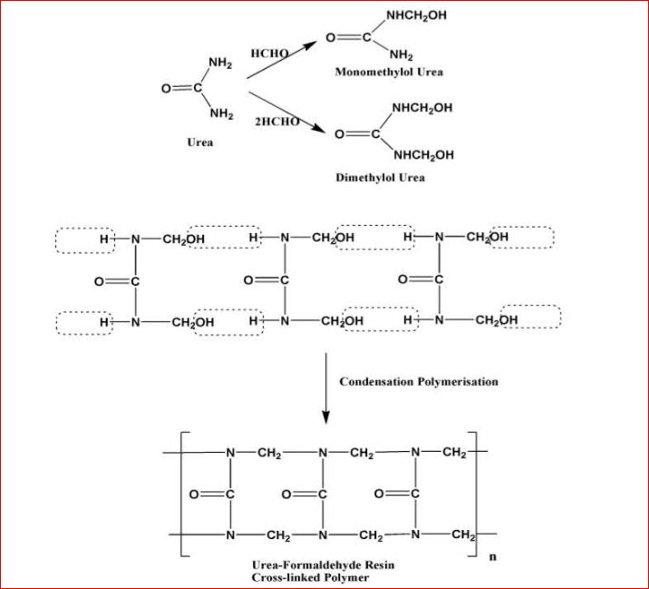

# Theory:-
 <b>1.Phenol-formladehyde Resin.</b> 
Phenol formaldehyde resins (PFs) are condensation polymers and are obtained by
condensing phenol with formaldehyde in the presence of an acidic or alkaline catalyst. They were
first prepared by Backeland, an American Chemist who gave them the name as Bakelite. These are
thermosetting polymers. 
<b>Thermosets:-</b> The polymers which on heating change irreversibly into hard rigid and infusible
materials are called thermosetting polymers. These polymers are usually prepared by heating
relatively low molecular mass, semi fluid polymers, which becomes infusible and form an insoluble
hard mass on heating. The hardening on heating is due to the formation of extensive cross-linking
between different polymeric chains. This lead to the formation of a 3-Dimnesional network of bonds
connecting the polymer chains. Since the 3D network structure is rigid and does not soften on
heating, the thermosetting polymers can not be reprocessed. Some important examples of
thermosetting polymers are Urea-Formaldehyde resin and Melamine-Formaldehyde resins. 

<b>Properties:-</b>
 1. Phenol- formaldehyde resins having low degree of polymerization are soft. 
 2. They possess excellent adhesive properties and are usually used as bonding glue for laminated wooden planks and in varnishes and lackuers. 
 3. Phenol- formaldehyde resins having high degree of polymerization are hard, rigid, scratchresistant and infusible. 
 4. They are resistant to non-oxidising acids, salts and many organic solvents. 
 5. They can withstand very high temperatures. 
 6. They act as excellent electrical insulators also.

<b>Uses:-</b>
1. They are used for making moulded articles such as radio and TV parts, combs, fountain pen, barrels, phonograph records etc. 
2. They are used for making decorative laminates, wall coverings etc. 
3. They are used for making electrical goods such as switches, plugs etc. 
4. They are used for impregnating fabrics wood and paper. 
5. They are used as bonding glue for for laminated wooden planks and in varnishes and lackuers. 
6. Sulphonated phenol-formaldehyde resins are use as ion-exchange resins. 

<b>Preparation:- </b> PFs are prepared by reaction of phenol with formaldehyde in the presence of acidic or
basic catalyst. The process may be carried out as follows
A mixture of phenol and formaldehyde are allowed to react in the presence of a catalyst. The process
involves formation of methylene bridges in ortho, para or both ortho and para positions. This results
first in the formation of linear polymer (Called NOVALAC) and then in to cross-linked polymer
called phenol-formaldehyde resin or bakelite.  

 

<b>2. Urea-formladehyde Resin.</b> 
Urea-formaldehyde is also called urea-methanal and is named so for its common synthesis pathway and overall structure. It is a non-transparent thermosetting resin or plastic which is made from urea and formaldehyde when they are heated in the presence of a mild base such as ammonia or pyridine. These resins are commonly used in adhesives, finishes, and molded objects as shown in the picture alongside.  Urea-formaldehyde resin was first produced in 1884 by Hölzer, who was working with Bernhard Tollens. 
A class of synthetic resins called  Urea-formaldehyde resin is obtained by chemical combination of urea (a solid crystal obtained from ammonia) and formaldehyde (a highly reactive gas obtained from methane). Urea-formaldehyde resins are used mostly as adhesives for the bonding of plywood, particleboard, and other structured wood products.

<b> Production Steps</b> 
The synthesis of a urea-formaldehyde resin occurs in two stages. In the first stage of production, urea is hydroxymethylolated by the addition of formaldehyde to the amino groups.  This reaction is i a series of reactions which lead to the formation of mono-, di-, and trimethylolureas. Tetramethylolurea is apparently not produced, but atleast not in a detectable quantity.

The addition of formaldehyde to urea takes place over the entire range of pH.  The reaction rate depends on the pH. The rate for the addition of formaldehyde to urea is successively form one, two, and three methylol groups which has been estimated to be in the ratio of 9:3:1, respectively.The exact ratio depends on the reaction conditions employed in the addition reaction.

The second stage of urea-formaldehyde resin production includes the condensation of the methylolureas to low molecular weight polymers. The rate at which these condensation reactions  occur is very dependent on the pH and, for all practical purposes depends on only atacidic pHs. The increase in the molecular weight of the urea-formaldehyde resin under acidic conditions is a combination of reactions leading to the formation of: 

1.methylene bridges between more amido nitrogens by the reaction of methylol and amino groups on reacting molecule; 
2.methylene ether linkages through the reaction of two methylol groups; 
3.methylene linkages from methylene ether linkages through the splitting out of formaldehyde; 
4.methylene linkages through the reaction of methylol groups splitting out water and formaldehyde in the proce. 
  
