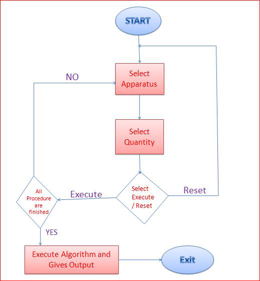
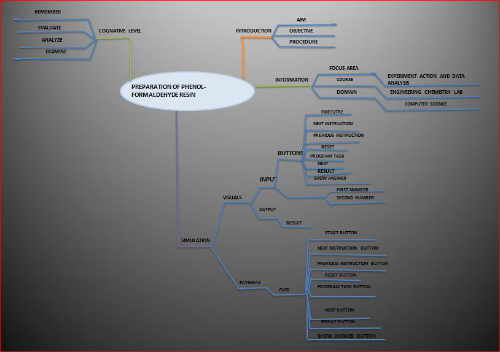

## Storyboard (Round 2)

Delete this line before submission : The core principle of Round 2 is to make the lab/experiment documentation elaborated in a manner that it makes easy for any person (developer/domain and non domain faculty/student) to understand and develop the lab/experiment.

Experiment 1: Preparation of Phenol-formaldehyde resin.
### 1. Story Outline:

Phenol-formaldehyde resin is also known as **phenolic resin** which is a type of thermosetting plastic. It is synthesized by condensation polymerization and cross-linking of phenol and formaldehyde by heating in presence of acid catalyst **Novolac** and bakelite are well known P-F resin. In presence of a base catalyst another P-F resin **Resol** is obtained. Atcommercial scale they are used in lamination, thermal resistance, adhessive and many more.  The chemical composition of phenoland formaldehyde and their combination into network are interlinked permanently that give them rigid and hard structure,it is due to crosslinked networking.

### 2. Story:

Describe the Story intorduction here (guide : The next step is to write a story. Story should be a brief logical description in simple English. It should talk about the overall execution of the experiment in a simplified manner. (should not include any equations/ drawings). The story should include the following points) )

#### 2.1 Set the Visual Stage Description:
Describe here : (guide When a user lands up into a simulator, the visual stage is the first thing that user comes across. The visual stage should include all the elements to be seen by a user on an imaginary canvas.  (This should NOT include any drawings. ) )

#### 2.2 Set User Objectives & Goals:
Describe the objectives and goals in details here : (guide : The user should clearly understand the aims and objective of the experiment. ( how he will begin experiment. ?  in descriptive))

#### 2.3 Set the Pathway Activities:

Describe the pathway activites here : (Guide : Set the pathway activities in line with the learning objectives (LOs)  & with a view to achieve the goals set in round #0 & round#1.  (once he begins, how he will traverse through the entire experiment ? in descriptive))

##### 2.4 Set Challenges and Questions/Complexity/Variations in Questions:

Describe the challenges Here : (guide : Set Challenges and Questions/Complexity/variations in questions according to User’s level, so as to invoke the learners’ interest.  (while traversing, what challenges he will face? how he has to solve and overcome ? descriptive).)

##### 2.5 Allow pitfalls:
1. If user missed to add a major chemical:   Caution indication of **"Please use proper chemical"** 
2. If user does not select correct amount:  Caution indication of **"Please choose correct amount of chemical"** 
3.If user does 

##### 2.6 Conclusion:
Describe conclusion here : (guide: This may include displaying: how much time did the user take to solve the questions/ How many questions were right?/ How many hints did the learner use. Based on this the evaluation/marking to be suggested to the user. (once he is towards the completion of the experiment, what LO he is taking along with him, what will be his probable, interpretation/conclusion , descriptive) )

##### 2.7 Equations/formulas: NA
Type equations here : (guide : ( a separate sheet having equations / programs for the lab exper3ment to be shared along with the Story submissions (1) . You can mark it as numerical reference numbers within the story narration (like we cite in the research papers) and then separately share these equations/programs sheets as a reference, do not include the equations as a whole in the narration))
Tool can be used to integrate formula in Markdown <b> [here](http://latex.codecogs.com/eqneditor/samples/example3.php) </b>

### 3. Flowchart 4
 
link to flow chart Here :<a href="flowchart/flowchart.png">Flowchart</a>
 

### 4. Mindmap:
 
 Link to mindmap here : <a href="mindmap/mindmap.png">Mind-map</a>
  

### 5. Storyboard :
Storyboard: <a href="Storyboard/carwiper.gif"> [here]</a>
Link to storybaord (.gif file ) here :
(guide: This document should include sketching and description scene wise (duration, action, description). Software to be used for storyboarding : https://wonderunit.com/storyboarder/ (Its a FOSS tool) . tutorial on how to use it https://www.youtube.com/watch?v=LAeCEpG0KX4
