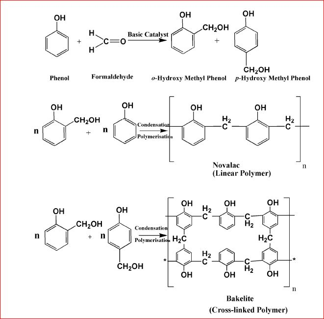
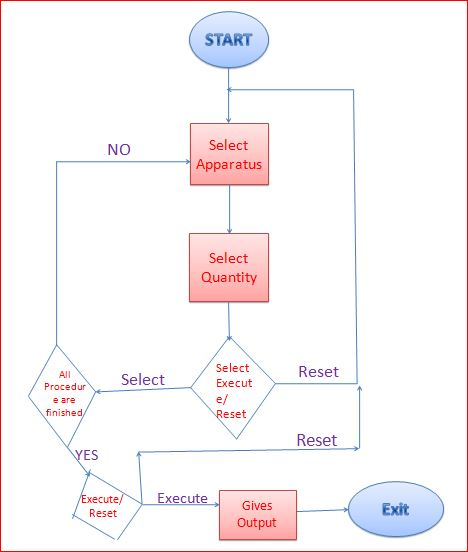
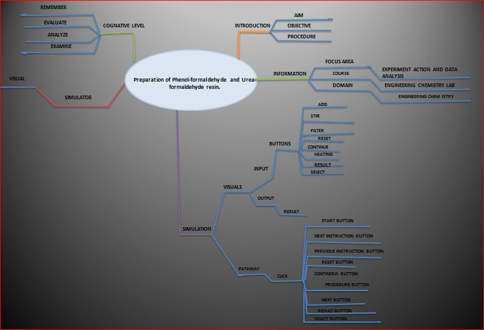
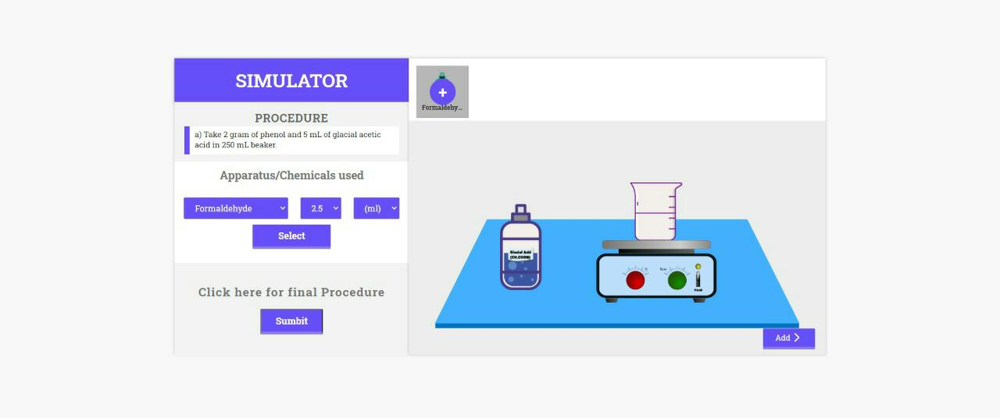
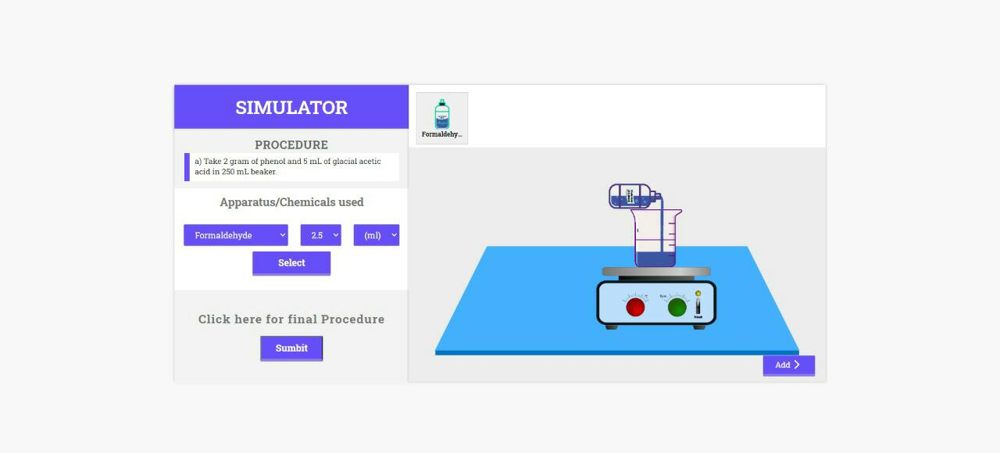

## Storyboard (Round 2)

Experiment 1: Preparation of Phenol-formaldehyde and Urea-formaldehyde resin.
### 1. Story Outline:

Phenol-formaldehyde resin is also known as **phenolic resin** which is a type of thermosetting plastic. It is synthesized by condensation polymerization and cross-linking of phenol and formaldehyde by heating in presence of acid catalyst **Novolac** and bakelite are well known P-F resin. In presence of a base catalyst another P-F resin **Resol** is obtained. Atcommercial scale they are used in lamination, thermal resistance, adhessive and many more.  The chemical composition of phenoland formaldehyde and their combination into network are interlinked permanently that give them rigid and hard structure,it is due to crosslinked networking. 
Urea-formaldehyde is also called urea-methanal and is named so for its common synthesis pathway and overall structure. It is a non-transparent thermosetting resin or plastic which is made from urea and formaldehyde when they are heated in the presence of a mild base such as ammonia or pyridine. These resins are commonly used in adhesives, finishes, and molded objects as shown in the picture alongside.  Urea-formaldehyde resin was first produced in 1884 by Hölzer, who was working with Bernhard Tollens.

### 2. Story:
The student clicks on the "Select" button for selecting the simulator. Once the simulator is started then they will follow the procedures shown in the simulator. When the user does not follow the working procedure or if it gives wrong input at any step then a caution pop-up will open.
The student has choice of selection of apparatus, chemicals, and their quantity by clicking on the "Select" button. When all steps will go correctly then after clicking on the "execute" button they will able to see the required P-F resin (U-F resin in case of Urea-formaldehyde simulator).  

#### 2.1 Set the Visual Stage Description:
The students has to click "Start" on simulator page for starting the experiment and they has to go through instructions provided by simulator on "Procedure" section. The user must know the stepwise procedure also.  
1.Click **Start**:Apparatus will be shown.  
2.A next procedure will popup on the page, by which user will understand better.  
3.Click **Next**: Chemical and apparatus will appear and also selected amount as mentioned in procedure.  
4. Then click **Next**:Next procedure will be shown and student will follow that procedure.  
5.When all procedure is done by student correctly then the result will show without any caution.  
6. When student wants to start from begining once again then he/she will click on **Reset** button on the screen.  

#### 2.2 Set User Objectives & Goals:
The objective of this experiment is to understand the phenonmenon of polymerization, concept of thermosetting plastic and mechanisme of condensation polymerization. The reaction of phenol and formaldehyde proceed in presence of HCl catalyst to form a hard, rigid and water insoluble polymeric compound is form called as phenol formaldehyde (P-F) resin.  In the urea-formaldehyde resin, formaldehyde reacts with urea in the presence of ulphuric acid to give solid white color polymer names as urea-formaldehyde resin.

#### 2.3 Set the Pathway Activities:

The pathways activities of preparation of P-F resin are: 
1. Mixing of phenol, formaldehyde and catalyst 
2. Heating the mixture with shaking 
3. Condensation reaction taken place 
4. Crosslinking occurs 
5. P-F resin formed. 
The pathways activities of preparation of u-F resin are: 
1. Mixing of urea, formaldehyde  
2.  Mixing the sulphuric acid in the mixture with shaking 
3. Condensation reaction taken place 
4. Crosslinking occurs 
5. U-F resin formed.

##### 2.4 Set Challenges and Questions/Complexity/Variations in Questions:
1. Difficulty Level: **Remember**  

Question 1. In preparation  of P-F resin, the catalyst is:  A. Phenol  B. Formaldehyde  **C. Hydrochloric Acid**  D. Water 

Question 2. The P-F resin is a:  A. Rubber  **B. Thermosetting Plastic**  C. Thermoplastic  D. Addition Polymer

2. Difficulty Level: **Evaluate**  

Question 1. A condensation reaction:  A. Two group are added only  **B. Two group form another group**  C. It is a decomposition reaction  D. It is a subsitution reaction  

Question 2. Urea is an:  **A. Organic compound**  B. Inorganic compound  C. Atom  D. Non-carbon compound

3. Difficulty Level: **Analyse**  

Question1: Solid P-F resin float on water due to:  A. It is soluble in water  **B. It is insoluble in water**  C. It can react with water  D. All above  

Question 1. U-F resin is:  A. A simple molecule   B. A complex compound  **C. A polymer**  D. None

4. Difficulty Level: **Examine**  

Question 1. P-F resin can be prepared by:  A. reaction of acetic acid and phenol   B. phenol and HCl   C. HCl and formaldehyde  **D. phenol and formaldehyde**  

Question 2. U-F resin is used as:  **A. Adhessive**  B. Food  C. Clothing  D. Motor 

##### 2.5 Allow pitfalls:
1. If user missed to add a major chemical:   Caution indication of **"Please use proper chemical"**  
2. If user does not select correct amount:  Caution indication of **"Please choose correct amount of chemical"**  

##### 2.6 Conclusion:
The main conclusions from this effort can be summarized as follows:  1) The Simulator can provide information on several aspects of polymer thermal decomposition behavior including kinetics and degradation mechanisms;  2) The Simulator model can be generalized to predict kinetics, product
evolution, tar yields, and tar molecular weight distributions for phenol formaldehyde and other charring polymers over a wide range of conditions; 
3) The key inputs required to model the decomposition of a charring polymer are the network parameters, depolymerization reactions, crosslinking reactions, and gas formation reactions; 
4) The choice between two alternative crosslinking reactions may lead to a different choice of network parameters. 

##### 2.7 Equations/formulas: 
<b>For Phenol-formaldehyde Resin.</b> 
 
<b>For Urea-frormaldehyde Resin.</b> 

### 3. Flowchart 4
 
link to flow chart Here :<a href="flowchart/flowchart.png">Flowchart</a>
 

### 4. Mindmap:
 
 Link to mindmap here : <a href="mindmap/mindmap.png">Mind-map</a>
  

### 5. Storyboard :
 
 

